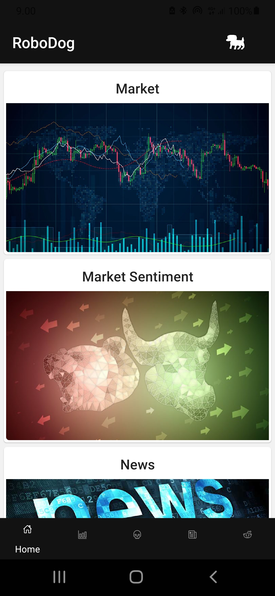
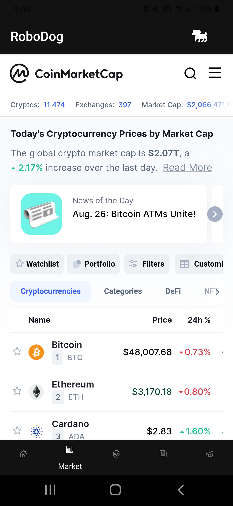
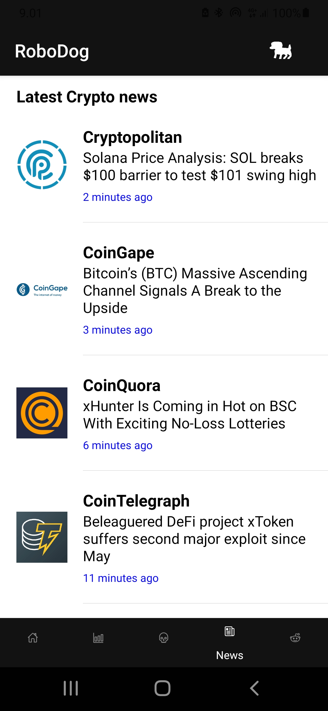

<!-- PROJECT LOGO -->
<br />
<p align="center">
  <h1 align="center">RoboDog</h1>
  <h4 align="center">Cryptomarket tracker</h4>
</p>


<!-- TABLE OF CONTENTS 
<details open="open">
  <summary>Table of Contents</summary>
  <ol>
    <li>
      <a href="#about-the-project">About The Project</a>
      <ul>
        <li><a href="#usage">Usage</a></li>
        <li><a href="#built-with">Built With</a></li>
      </ul>
    </li>
    <!--
    <li>
      <a href="#getting-started">Getting Started</a>
      <ul>
        <li><a href="#prerequisites">Prerequisites</a></li>
        <li><a href="#installation">Installation</a></li>
      </ul>
    </li>
     
    <li><a href="#roadmap">Roadmap</a></li>
    <li><a href="#contributing">Contributing</a></li>
    <li><a href="#license">License</a></li>
    <li><a href="#contact">Contact</a></li>
    
    <li><a href="#acknowledgements">Acknowledgements</a></li>
  </ol>
</details>
-->

## About The Project

The main reason for this project is to collect all the important information about cryptocurrencies in the same place. <br>
With RoboDog app you can follow up:

<ul>
  <li>CoinMarketCap -market data </li>
  <li>Alternative Fear & Greed Index and analysis </li>
  <li>Latest crypto news from Cryptocompare </li>
  <li>Discussions about cryptomarkets from SatoshiStreetBets on Reddit </li>
</ul>  

This project is created from the pure interest in cryptocurrencies. <br>
You can find more details below about how to run the app on your phone or another emulator. You can also build standalone app for your phone by creating apk-file in Expo! Read more instructions below.

## Usage

<div float="left">





</div>

## Built With

* [Expo](https://docs.expo.io/)
* [React Native](https://reactnative.dev/)
* [React Native Paper](https://callstack.github.io/react-native-paper/)
* [Native Base](https://nativebase.io/)

### API sources
* [Cryptocompare](https://min-api.cryptocompare.com/documentation)
* [Alternative](https://alternative.me/crypto/api/)


### Acknowledgements
* [Ionic](https://ionic.io/ionicons)
* [Moment.js](https://momentjs.com/)


## Getting Started

To get a local copy up and running follow these simple steps.

### Installation

1. Clone the repo
   ```sh
   git clone https://github.com/janipalomaki/robodog.git
   ```
2. Open a terminal in your project´s folder and run:
   ```sh
   yarn install 
   yarn add react-native-paper 
   yarn add native-base styled-components styled-system 
   yarn add @react-navigation/native 
   yarn add @react-navigation/stack 
   ```
   Commands below will install:
   All the dependencies listed within package.json in the local node_modules folder, React Native Paper component library, NativeBase component library, 
   React Navigation and Stack module.
   
   
3. Get a free API Key at [Cryptocompare](https://min-api.cryptocompare.com/pricing) & [Alternative](https://alternative.me/crypto/api/)

4. Enter your Cryptocompare API-key in `LatestNews.js`
   ```JS
   const api_key = 'ENTER YOUR API';
   ```
   
   Enter your Alternative API-key in `Sentiment.js`
   ```JS
   const api_key = 'ENTER YOUR API';
   ```
   
5. Run ```expo start``` in terminal and start exploring RoboDog App!
   
   
   For testing you need to create an emulator or connect your device as a emulator. 
   More info about setting up Emulator from [here](https://docs.expo.dev/workflow/android-studio-emulator/)
   
6. Build standalone RoboDog App!
   
   More info about building standalone app from [here](https://docs.expo.dev/classic/building-standalone-apps/)
   

<!-- ROADMAP 
## Roadmap

See the [open issues](https://github.com/othneildrew/Best-README-Template/issues) for a list of proposed features (and known issues).
-->

## Contributing

Contributions are what make the open source community such an amazing place to be learn, inspire, and create. Any contributions you make are **greatly appreciated**.

1. Fork the Project
2. Create your Feature Branch (`git checkout -b feature/AmazingFeature`)
3. Commit your Changes (`git commit -m 'Add some AmazingFeature'`)
4. Push to the Branch (`git push origin feature/AmazingFeature`)
5. Open a Pull Request

<!--
## License

Distributed under the MIT License. See `LICENSE` for more information.


<!-- CONTACT 
## Contact

Your Name - [@your_twitter](https://twitter.com/your_username) - email@example.com

Project Link: [https://github.com/your_username/repo_name](https://github.com/your_username/repo_name)
-->


